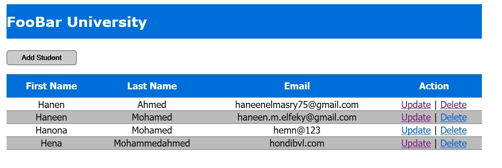
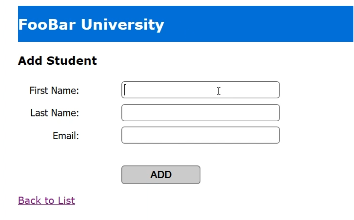

# Servlet

## 📌 What is Servlet?
Servlet is a Java class used to create dynamic web applications. It runs on a server and handles HTTP requests and responses between the client (browser) and the server. Servlets are a core part of Java’s web development stack, and they make it easy to manage and process data sent by users.

## Project Overview
In this project, I built a simple CRUD (Create, Read, Update, Delete) application using Java Servlets. It was a great way to learn how to connect with a database and manage data through basic web operations. I explored how HTTP requests and responses work, and I got hands-on experience with JDBC and configuring servlets in a web project.

 ## Features
Create Operation

Users can add new entries to the database through a form.
Read Operation

Displays all records neatly so users can view the stored data.
Update Operation

Allows users to edit and update existing records easily.
Delete Operation

Enables users to remove any records they don't need anymore.
Simple UI with HTML & JSP

Basic user interface to interact with the application using forms and tables.

## Implemented Functionalities
1️⃣ Database Connection with JDBC: 
Connected to a database using JDBC to manage the CRUD operations.

2️⃣ Servlet Mapping in web.xml: 
Configured web.xml to map URLs to specific servlets for organized request handling.

3️⃣ Handling HTTP Requests:  
Used doGet() and doPost() methods to manage user input and return appropriate responses.

4️⃣ Basic Error Handling:      
Added error handling to catch exceptions and display friendly messages when things go wrong.

<table>
  <tr>
    <td align="center">
      
       
      <strong> Table Overview  </strong>
    </td>
    <td align="center">
      
       
      <strong>Create & Update Operations</strong>
    </td>
  </tr>
</table>

